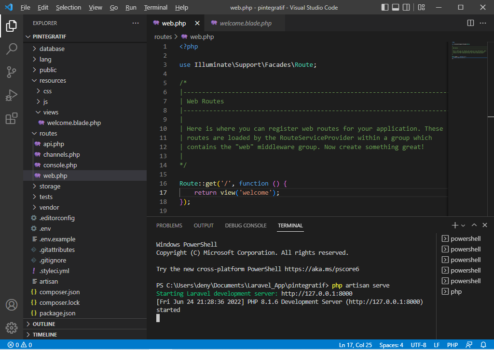

# Tugas Besar Pemrograman Integratif
**Deny Satria Ardi  1202190026 || IT 02-01** 

<br />

-----

### Tahap 1 
#### Install PHP

•	Download php di website https://windows.php.net/download#php-8.1. Pilih file zip Thread Safe

  

•	Ekstrak file php, kemudian copy di lokasi “ C:\Program Files “. Cari file bernama "php.ini development", buat salinan dan ubah nama file salinan menjadi  “php.ini”.     buka menggunakan text editor, dan jadikan seperti pada gambar, kemudian simpan.

  
  
  
•	Buka “Edit The System Environment Variables”, klik Environment Variables

  
  
•	Pilih variabel path untuk menambahkan alamat dari file php, kemudian pilih ok.

  

•	Buka terminal dan ketikkan ``php –v``, maka akan muncul tampilan seperti digambar, yang artinya php berhasil terinstall.

  

### INSTALL COMPOSER

•	Downlaod Composer https://getcomposer.org/download/

  

•	Install file composer seperti biasa. Jika sudah buka terminal dan ketik “composer”, maka akan muncul tampilan seperti digambar, yang mana composer sudah terinstall.

  

### INSTALL LARAVEL VIA COMPOSER 

•	Buka website https://laravel.com/docs/9.x#installation-via-composer, untuk menyalin command installasi laravel via composer

•	Buat folder baru di komputer untuk menginstall laravel (bebas lokasinya). Klik kanan dan buka dengan Git Bash Here

  
 
 •	Buat project untuk install laravel dengan command
 
```
composer create-project laravel/laravel nama_project
```
  
  

•	Masuk  terlebih dahulu ke folder project yang sudah dibuat dengan command
```
cd pintegratif/
```
• Kemudian buka file installasi laravel dengan text editor (disini dengan visual studio code) dengan command 
```
code .\pintegratif\
```
  
  
• Maka akan secara otomatis membuka aplikasi visual studio code
•	Klik menu terminal pada bagian atas, pilih terminal baru, lalu masukkan command
```
php artisan serve
```
  
  
•	Copy server laravel, untuk dibuka di browser

  
